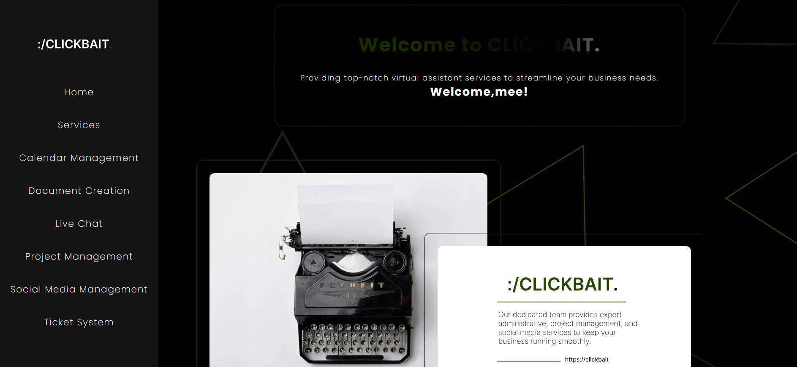
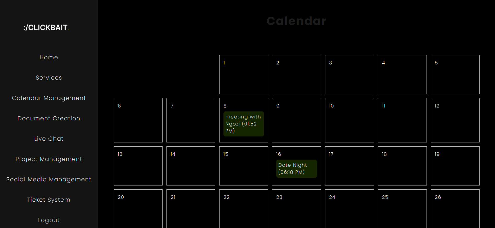
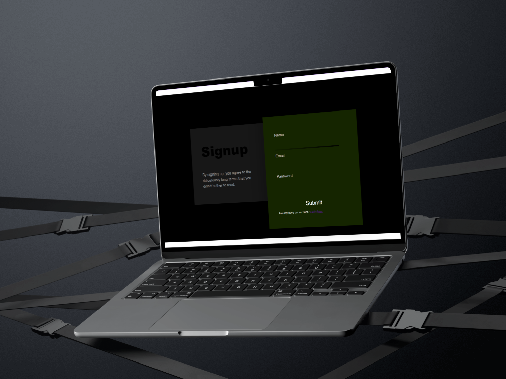
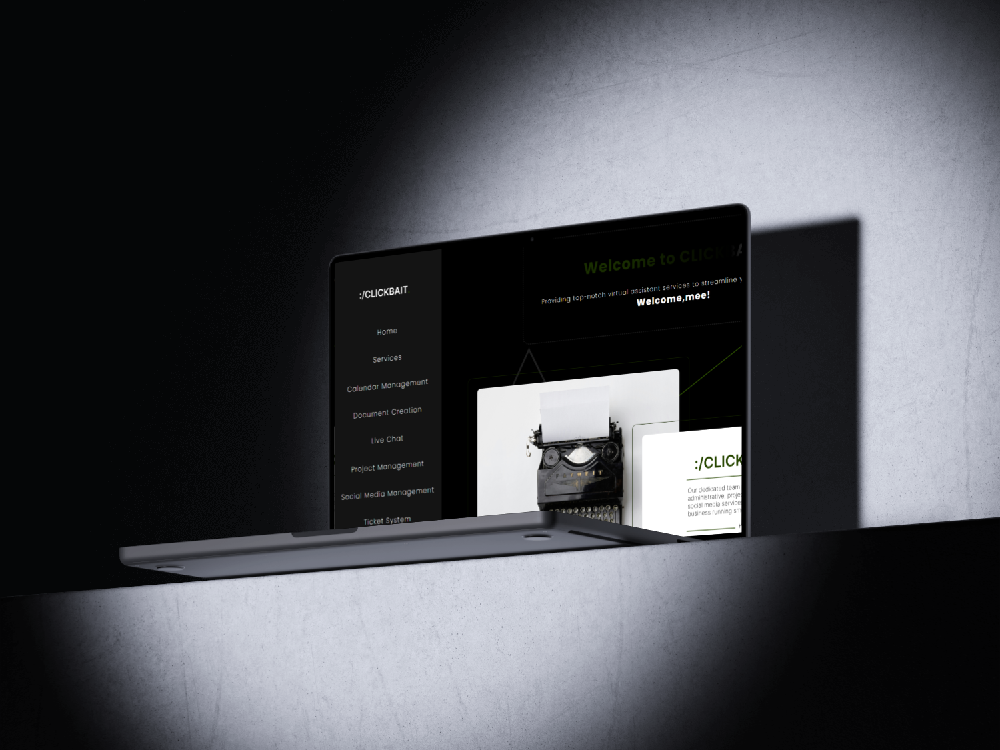
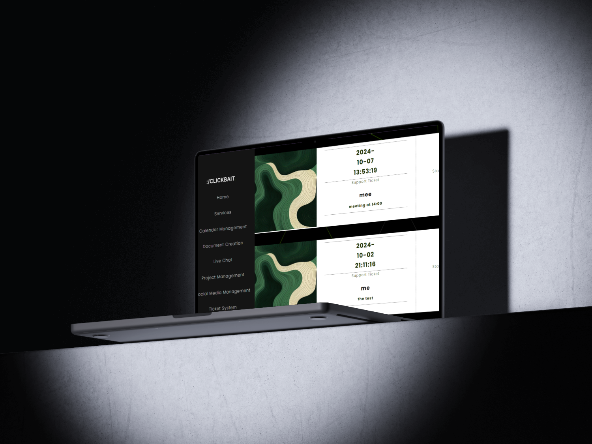
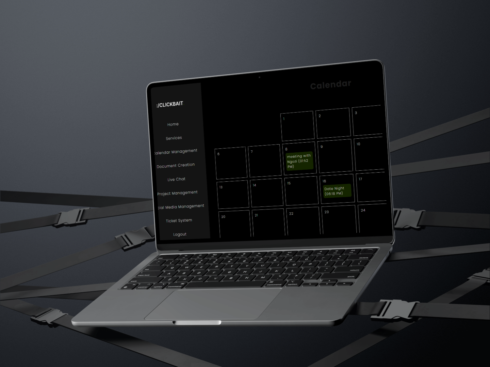
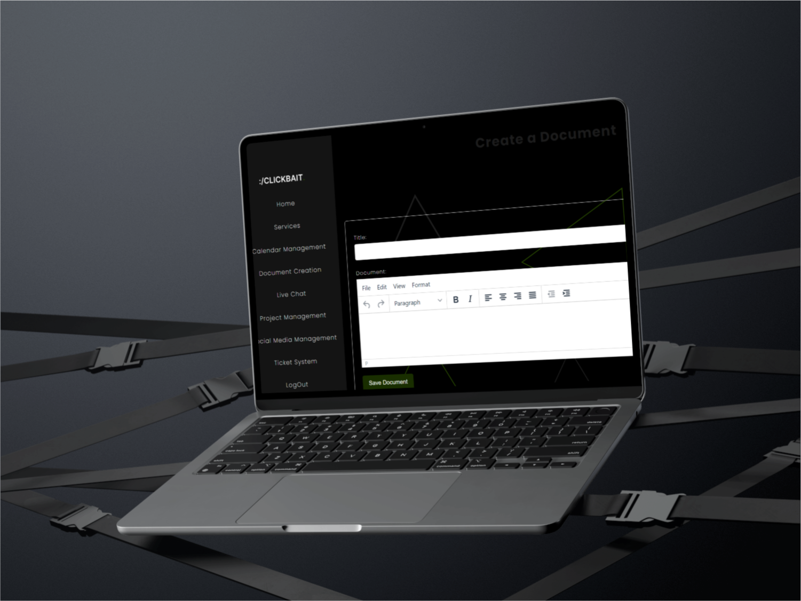

# ClickBait



---

# About Clickbait.

Welcome to clickbait a virtual assistant service offered by Selah.inc a management company that helps you elevate your comapany's productivity without having having yo worry about the nitty gritty of your day-to-day schedule, let us take care of that.

### Built With

[](https://www.w3.org/html/)
[](https://www.w3.org/Style/CSS/Overview.en.html)
[](https://www.javascript.com/)
[](https://www.php.net/)
[](https://www.mysql.com/)



## How To Install

To get started, clone the repo:

```
Open https://github.com/Brilu-22/Service.git in the Github Desktop
```

Once Opened check the structure of the folders

# Project Structure

## PHP_PROJECT...

- `Service/`
  - `css/`
  - `includes/`
  - `pics/`
- `add_event.php`
- `babel.js/`
  - `calender.html/`
  - `calender.js/`
  - `document_creation.php`
  - `events.php`
  - `home.php/`
  - `live_chat.php`
  - `login.php`
  - `logout.php`
  - `project_management.php`
    - `save_document.php`
  - `services.php`
  - `signup.php`
  - `social_media_management.php`
  - `ticket_system.php`

## PAGES AND FUNCTIONALITY

| Page                                        | Description                                                                                                                                                                                                                                                                                |
| ------------------------------------------- | ------------------------------------------------------------------------------------------------------------------------------------------------------------------------------------------------------------------------------------------------------------------------------------------ |
| Login Page                                  | - Users are required to create accounts by signing up by clicking on the sign up button                                                                                                                                                                                                    |
|                                             | - login using their credentials to access the app                                                                                                                                                                                                                                          |
| Home Page                                   | - The structure of the home page is just purely a glimpse as to what the user will expect from the app                                                                                                                                                                                     |
|                                             | - This page serves as a Questions and Answers page , where questions are viewed as posts and answers as comments, and clicking on the various message icon you can view the different questions/answers others have posted                                                                 |
| services page                               | - This page is for the different service we provide , and also joins with the about us page                                                                                                                                                                                                |
| calender page                               | - This page allows for you to create a reminder on your calendars , so its similar to a day planner , it's actually a virtual day planner , that keeps record of your planners and schedules                                                                                               |
| Document creation page                      | As the name suggests this page is your document creation, you create all your documents and it shows you all your recent and old documents                                                                                                                                                 |
| Live Chat,Ticket system, social media pages | - These pages serve part of the consultation/contact us page and they are exactly as they sound they they help you chat to a "consultant" , the ticket system works for the consulation system , where the admin keeps record of the time, date and name of the user that needs assistance |

|

## Website Concept

Modern , techno fusion concept a concept that brings in a fresh new view of how the "google calender" of tomorrow will look like


## UI Design

### Login



### Homepage



### Ticket Page



## Development Process

### Succession Processes

- The intended functionality of the code works , even though there are some cracks it code produces the intended outcomes

### C.R.U.D Functionality

- Create - Users can create schedules.
- Read - The read functionality works at it's best , where read requests are given even though there seems to be some hiccups, but for the most part it words.
- Update - Users can update/edit profiles and change their user ids in the settings page.
- Delete - Users can delete schedules .

## Challenges

- main Challenge would have to be working with a different DBMS from last term so some things I had to learn again
- New DBMS = New Problems, The database kept on crashing and giving all sorts of errors , which consumed a lot of my time and productivity.
- Since it's also the first time I'm working with php at times my code would give some complicated and non-understandable errors ( still does , hence some of my functionality is screwed ).

## Future Solutions

- Take more time learning the database and language
- Don't take too much time with animations and making the website look cool
- Add the ability for all users to fully see everyones comment , and creating different communities for different topics to make it much easier for users to interact with the website.
- Also gsap isn't for everyone ( I learnt the hard and long way )

## Mockups

### Home Mockup


### Calender Mockup



### Live Chat Page Mockup


### Ticket Page Mockup


### Document Creation Page Mockup



## Demonstration

[Link To Demonstration Video]()

### License

[MIT](LICENSE) © Lebogang Brilu Zechaniah Hlongwane
